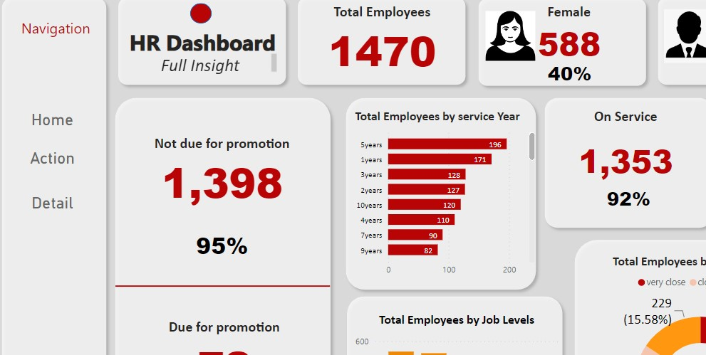

# HR-dashboard-project
HR Analysis Dashboard, which provides real-time access to vital HR metrics and insights. 

HR decisions is critical to increasing worker productivity, encouraging employee engagement, and eventually leading the company to unprecedented success. You can make well-informed, data-driven decisions that directly affect hiring, employee retention, and talent development with our intuitive HR Analysis Dashboard, which provides real-time access to vital HR metrics and insights. Unlocking the full potential of your personnel and obtaining a competitive edge in the careful management of your most important asset are made possible by this useful resource.

